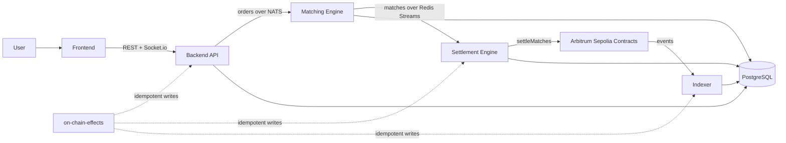
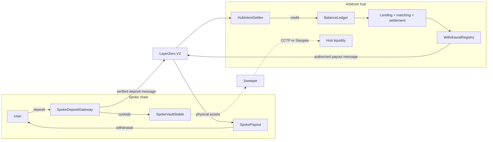

# Centuari

Centuari is a decentralized fixed-rate lending protocol with off-chain order matching and on-chain custody and settlement.

> **Development status:** Centuari currently targets the **Arbitrum Sepolia testnet** (`421614`) in a hub-only configuration. Mainnet is not live. Spoke chains, LayerZero messaging, per-chain liquidity, and the cross-chain user experience are deferred to a later phase.

## How the system fits together



Users retain on-chain custody while Centuari keeps latency-sensitive order matching off-chain. The backend accepts authenticated orders and sends them to the matching engine. The matching engine maintains in-memory order books and emits matched pairs. The settlement engine batches those matches into `Settlement.settleMatches()` transactions. The indexer follows confirmed contract events and projects them into the shared database.

The backend, settlement engine, and indexer can observe the same transaction at different times. The shared `on-chain-effects` package verifies receipts and stamps mutations by transaction hash and log index so the second writer safely becomes a no-op.

## Cross-chain architecture — designed, deferred

> **Not part of the current launch:** The architecture below describes
> Centuari's planned cross-chain phase. The active product remains hub-only on
> Arbitrum Sepolia. Cross-chain contracts and indexer seams exist in the
> codebase, but the spoke deployment, liquidity routing, operations, and user
> experience are not live.

Centuari is designed around a hub-and-spoke model. Lending markets, collateral
accounting, order matching, and settlement remain on the Arbitrum hub. Spoke
chains act as deposit and withdrawal edges, so adding a chain does not create a
separate lending market or fragment the order book.



### Deposit lifecycle

1. A user deposits a supported asset through `SpokeDepositGateway`.
2. The spoke records the deposit and places the asset into the appropriate
   custody path. Bridged assets can later move to the hub; spoke-native assets
   remain on their origin chain.
3. LayerZero delivers the deposit message to the trusted
   `HubIntentSettler` peer on Arbitrum.
4. `HubIntentSettler` credits the user's hub balance through `BalanceLedger`.
   The user can then enter the same hub-local lending and borrowing flow as a
   direct Arbitrum depositor.
5. A separate sweeper reconciles physical liquidity. It routes supported assets
   through CCTP or Stargate without blocking the accounting message that makes
   the deposit visible on the hub.

Conceptually, the projected deposit record passes through three milestones that
make that separation explicit:

```text
INITIATED  →  CREDITED  →  BRIDGED
spoke tx      hub balance   physical liquidity reconciled
```

Messaging and liquidity movement are separate on purpose. LayerZero carries
the authenticated accounting intent, while CCTP or Stargate moves the actual
tokens. This keeps the lending system hub-local and avoids coupling user-facing
credit confirmation to a slower bridge operation.

### Withdrawal path

Cross-chain withdrawals reverse the edge of the system without moving the
lending market itself. `WithdrawalRegistry` applies the hub's balance and risk
checks, records the requested destination, and authorizes the spoke payout.
`SpokePayout` releases funds only through its configured cross-chain path and
the selected destination must have sufficient available liquidity.

### Safety and recovery model

| Failure boundary | Architectural control |
|---|---|
| Forged cross-chain credit | `HubIntentSettler` accepts messages through the configured LayerZero endpoint and trusted peer for each endpoint ID. |
| Duplicate delivery or competing database writers | Deposit identifiers and transaction/log stamps make state projection idempotent. |
| Chain reorganization | Each indexer watcher tracks a chain-scoped block cursor and block hash, removes affected projections, and replays from the fork point. |
| Bridge delay | Accounting state distinguishes hub credit from physical bridging, making delayed liquidity visible rather than treating it as a completed transfer. |
| Insufficient destination liquidity | Per-chain liquidity accounting constrains where a withdrawal can be fulfilled. |
| Deposit that never confirms | Bridged deposits include an original-depositor timeout/refund path. Activation must also prove that hub acknowledgement closes the credit-then-refund race. |

Before this design becomes a product surface, every hub/spoke route must pass
an end-to-end activation gate: trusted peers and LayerZero options configured,
credit/refund acknowledgement proven race-safe, asset classifications matched
on both chains, liquidity accounting reconciled, and deposit plus withdrawal
recovery tested under delayed and replayed messages.

### Future solver fast-fill

The first cross-chain phase is designed to wait for LayerZero confirmation
before crediting the hub balance. A later solver layer can reduce that latency:
a solver observes and validates the spoke deposit, calls
`HubIntentSettler.fillFor()` to front hub liquidity, and records its
reimbursement claim in `SettlementLedger`. When the underlying transfer is
reconciled, the solver can recover the capital it advanced.

The `fillFor` and `SettlementLedger` seams are deliberately dormant. Activating
them requires solver operations, capital limits, monitoring, and reimbursement
controls beyond the current hub-only launch.

## Repositories

### User-facing applications

| Repository | Role |
|---|---|
| [`frontend-revamp`](https://github.com/centuari-labs/frontend-revamp) | Next.js trading application for wallet connection, markets, orders, collateral, and portfolio management |
| `landing-page` | Marketing site and waitlist tooling; private repository |

### Protocol services

| Repository | Role |
|---|---|
| [`backend-v2`](https://github.com/centuari-labs/backend-v2) | NestJS API, authentication, order intake, market data, and database migration authority |
| [`matching-engine`](https://github.com/centuari-labs/matching-engine) | Standalone two-process service for in-memory matching and asynchronous database writes |
| [`settlement-engine`](https://github.com/centuari-labs/settlement-engine) | Worker that batches matches, submits settlement transactions, and records results |
| [`indexer-v3`](https://github.com/centuari-labs/indexer-v3) | Hub-only Arbitrum Sepolia event indexer with reorg-safe database projections |

### Contracts and shared package

| Repository | Role |
|---|---|
| [`smart-contract-revamp`](https://github.com/centuari-labs/smart-contract-revamp) | Foundry project containing Centuari's upgradeable contracts and deployment scripts |
| [`on-chain-effects`](https://github.com/centuari-labs/on-chain-effects) | Shared verify-then-apply idempotency package used by database writers |

### Internal documentation

| Repository | Role |
|---|---|
| `dev-docs` | Private architecture, launch, operations, and engineering documentation |

Private repositories are listed to make the system boundary clear but are intentionally not linked from this public document.

## Current launch boundary

The active launch uses one hub chain:

- All deposits and withdrawals execute on Arbitrum Sepolia.
- Lending, borrowing, collateral checks, matching settlement, and indexing use the hub contracts.
- The frontend does not expose spoke-chain or cross-chain flows.
- Cross-chain code that remains in individual repositories is implemented or exploratory work for a later phase, not part of the current operating path.

The settlement engine includes a recovery worker for matches stuck in `PENDING`. That worker is separate from the deferred cross-chain sweeper.

## Operational dependency order

Centuari is a collection of independently versioned repositories, not a single installable monorepo. Each component README owns its detailed setup instructions. At a system level, the dependency order is:

1. Deploy the hub contracts from `smart-contract-revamp` using a local environment file or secret manager. Never paste private keys into shell commands or commit credential files.
2. Export and synchronize deployment addresses and ABIs from the smart-contract repository into the consuming services.
3. Start PostgreSQL, Redis, and NATS, then run the backend-owned database migrations.
4. Start the matching engine and its DB-writer process, followed by the settlement engine, indexer, and backend API.
5. Start the frontend against the configured backend and Arbitrum Sepolia deployment.

Some services consume the private `@centuari-labs/on-chain-effects` package through GitHub Packages. Contributors to those repositories need read-only package access; tokens must stay outside the repository and out of logs.

## Security

This repository contains public architecture documentation only. Do not commit environment files, wallet keys, package tokens, database credentials, deployment artifacts containing secrets, or internal runbooks.

Security issues should not be opened as public issues. Contact the Centuari maintainers privately with a description, affected component, reproduction steps, and potential impact.

## License

Licensing is defined by each component repository. This umbrella repository does not grant additional rights to code maintained elsewhere.
